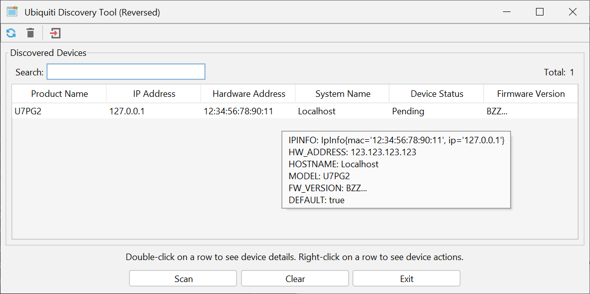

# Ubnt-Discovery-Tool

This tool is a renewed implementation of the original [Ubnt-Discovery-Tool](https://www.ui.com/download/utilities/default/default/ubiquiti-discovery-tool-chrome-app) which hasn't been updated since 2017. Because the latest version offered by _Ubiquiti_ is very CPU-heavy and does not work properly as described in many issues at their forum, this repository offers an updated version of that tool.

If you want to use this tool in your browser, Ubiquiti also offers a Chrome Web-Extension of this utility that "should" work.

This tool can either be compiled or one of the pre-compiled versions from the `Releases` page of this repo can be used. Detailed building instructions can be found in the [wiki](https://github.com/MatrixEditor/ubnt-discovery-tool/wiki) of this repository. Start it with the following command.

````console
java -jar ubnt-discovery-tool-VERSION.jar
````

**Note:** This renewed version uses the `MulticastSocket` by Java that can receive multicast and broadcast messages in combination with a `FixedThreadPool` which lowers the CPU-usage compared to the older version.

## Application principles

This utility is designed to search in the local network for devices manufactured by Ubiquiti by sending discovery packets (version 1 and 2). For application design and build information, see the wiki of this repository.

A user interface (UI) guide will also be available in the wiki. By default, the application creates a packet listener for every `NetworkInterface` of the local machine. With the `ubnt.ipv6.enabled` key in the application's properties you can specify whether IPv6 sockets should be created. 

At the moment, the following functions are implemented:

1. Scanning the network for devices (10s interval)
2. Show details of each device by hovering over it (ToolTip)

Releases will be published with and without the `FlatLaf` LookAndFeel dependency to prevent errors with Java version `1.8`. A quick impression of what the output of this utility looks like (mocked service):



## Building

UbntDiscoveryTool uses [Gradle](https://gradle.org) to build. To just compile the source code of this app, run:

    ./gradlew build --warning-mode all

If you want to build the app with all dependencies, run:

    ./gradlew build UbntTool --warning-mode all

This utility requires at least Java 9 if you want to use the FlatLaf UI, otherwise 

## Getting Help

* Add an issue on GitHub
* Check the project's [wiki](https://github.com/MatrixEditor/ubnt-discovery-tool/wiki)