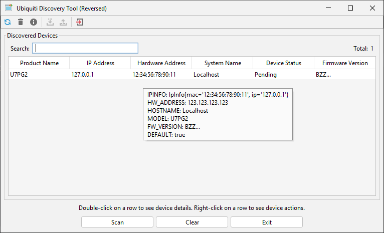

# Ubnt-Discovery-Tool

This tool is a renewed implementation of the original [Ubnt-Discovery-Tool](https://www.ui.com/download/utilities/default/default/ubiquiti-discovery-tool-chrome-app) which hasn't been updated since 2017. Because the latest version offered by _Ubiquiti_ is very CPU-heavy and does not work properly as described in many issues at their forum, this repository offers an updated version of that tool.

Features of this repository:

- Java(-Swing) GUI
- CLI support
- Minimal Python implementation of the Ubnt Discovery Protocol
- Wireshark dissector in Lua for the Ubnt Discovery Protocol

If you want to use this tool in your browser, Ubiquiti also offers a Chrome Web-Extension of this utility that "should" work.

This tool can either be compiled or one of the pre-compiled versions from the `Releases` page of this repo can be used. Detailed building instructions can be found in the [wiki](https://github.com/MatrixEditor/ubnt-discovery-tool/wiki) of this repository. Start it with the following command.

````console
java -jar ubnt-discovery-tool-VERSION.jar
````

> **Note:** This renewed version uses the `MulticastSocket` by Java that can receive multicast and broadcast messages in combination with a `FixedThreadPool` which lowers the CPU-usage compared to the older version.

## Application principles

This utility is designed to search in the local network for devices manufactured by Ubiquiti by sending discovery packets (version 1 and 2). For application design and build information, see the wiki of this repository.

A user interface (UI) guide will also be available in the wiki. By default, the application creates a packet listener for every `NetworkInterface` of the local machine. With the `ubnt.ipv6.enabled` key in the application's properties you can specify whether IPv6 sockets should be created. 

At the moment, the following functions are implemented:

1. Scanning the network for devices (10s interval)
2. Show details of each device by hovering over it (ToolTip)
3. [Since v1.2]: Import and export XML-Documents that contain the structure equal to the [example.xml](/docs/example.xml) document.
4. [Since v1.3]: CLI support

Releases will be published with and without the `FlatLaf` LookAndFeel dependency to prevent errors with Java version `8`. A quick impression of what the output of this utility looks like (mocked service):



## CLI support

Since release v1.3, there is support for a CLI version of the UbntDiscoveryTool. It can be addressed by adding the `-cli` argument: (**This option must come first**)

```bash
java -jar ./build/libs/ubnt-discovery-tool-1.3.jar -cli -help
Usage: <main class> [options]                    
  Options:                                       
    -file                                        
      Prints information from the given XML file.
    -g, -grouped                                 
      Prints grouped output.                     
      Default: false                             
    -h, -help                                    
      Shows this usage information.              
      Default: false                             
    -I, -interface                               
      Interface names to include.                
      Default: []                                
    -ratio
      The second-ratio (amount of internal loops).
      Default: 20
    -sec
      The amount of seconds to listen for packets.
      Default: 10000
```

> *Note*: Unless `-file` is used to dump an XML file, all received multicast packets will be displayed.

Example output:

```bash
# --- snip ---
============ 'U7PG2' v0x002@wlan2 ============
       IPINFO (0x2): IpInfo{mac='...', ip='172.39.0.204'}
   HW_ADDRESS (0x1): ...
       UPTIME (0xa): 1781702
     HOSTNAME (0xb): Zi351
     PLATFORM (0xc): U7PG2
   FW_VERSION (0x3): BZ.qca956x_6.0.21+13673.220607.2004
SHORT_VERSION (0x16): 6.0.21.13673
     MODEL_V2 (0x15): U7PG2
      DEFAULT (0x17): false
     LOCATING (0x18): false
        DHCPC (0x19): true
  DHCPC_BOUND (0x1a): true
   SOURCE_MAC (0x13): ...
          SEQ (0x12): 355003
        DHCPC (0x19): true
  DHCPC_BOUND (0x1a): true
   SOURCE_MAC (0x13): ...
          SEQ (0x12): 790191
        REQ_W (0x1b): 3.4.1
    <Unknown> (0x27): length=46 (0x2e)
# --- snip ---
```

## Building

UbntDiscoveryTool uses [Gradle](https://gradle.org) to build. To just compile the source code of this app, run:

    ./gradlew build --warning-mode all

If you want to build the app with all dependencies, run:

    ./gradlew build UbntTool --warning-mode all

This utility requires at least Java 9 if you want to use the FlatLaf UI. 

## Getting Help

* Add an issue on GitHub
* Check the project's [wiki](https://github.com/MatrixEditor/ubnt-discovery-tool/wiki)